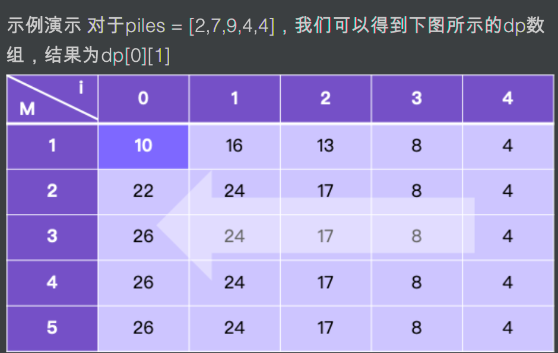

```java
class Solution {
    public int stoneGameII(int[] piles) {
        int len = piles.length;
        int[][] dp = new int[len][len+1];
        int sum = 0;
        for(int i=len-1; i >= 0; i--){
            sum += piles[i];
            for(int M=1; M <= len; M++){
                if(i+2*M >= len){
                    dp[i][M] = sum;
                } else {
                    for(int x=1; x <= 2*M; x++){
                        dp[i][M] = Math.max(dp[i][M],sum - dp[i+x][Math.max(M,x)]);
                    }
                }
            }
        }
        return dp[0][1];
    }
}
```

① 有两个玩家，每次都是以自己的利益最大化执行操作

② 玩家A第一个拿，初始M=1，初始能够拿的x范围在【1，2】，玩家B能够拿的x范围在【1，2】（如果玩家A拿的x=1），或者【1，4】（如果玩家A拿的x=2）

③ `dp[i][j]` ，其中i表示剩余stones.length-i（例如i=len-1，所以剩下1堆石子），M=j时能够A能够获取的最小石头数


