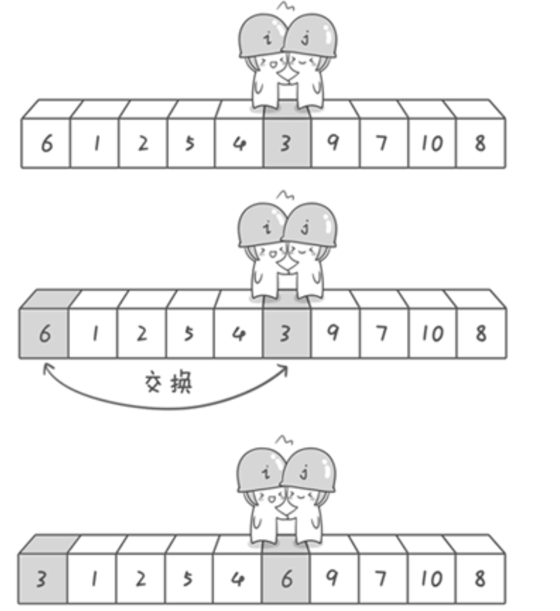

```java
class Solution {
    public int findKthLargest(int[] nums, int k) {
        int left = 0, right = nums.length-1;
        int target = nums.length-k;
        while(true){
            int index = partition(nums,left,right);
            if(index == target){
                return nums[index];
            } else if(index < target){
                left = index+1;
            } else if(index > target){
                right = index-1;
            }
        }
    }

    public int partition(int[] nums, int l, int r){
        int pivot = nums[l];
        int i = l, j = r;
        while(i < j){
            while(nums[j] >= pivot && i < j){
                j--;
            }
            while(nums[i] <= pivot && i < j){
                i++;
            }
            if(i < j){
                swap(nums,i,j);
            }
        }
        nums[l] = nums[i];
        nums[i] = pivot;
        return i;
    }

    public void swap(int[] nums, int index1,int index2){
        int temp = nums[index1];
        nums[index1] = nums[index2];
        nums[index2] = temp;
    }
}
```

① 长度为len的数组，找到第k大的数，这个数在排序后数组中的下标是len-k

② 直接快速排序，然后return nums[len-k]，时间复杂度是O(N * logN)，这个过程有部分操作多余

③ 快排的本质在于每次确定一个节点，例如pivot




（1）如果pivot的下标比target小，直接对（pivot+1，right）部分partition

（2）如果pivot的下标比target大，直接对（left，pivot-1）部分partition

（3）如果pivot = target，说明就是这个已经确定的数，nums[pivot]就是我们需要的返回值


优化：为了防止快排遇到最坏情况，可以加入随机数设置pivot初始值


