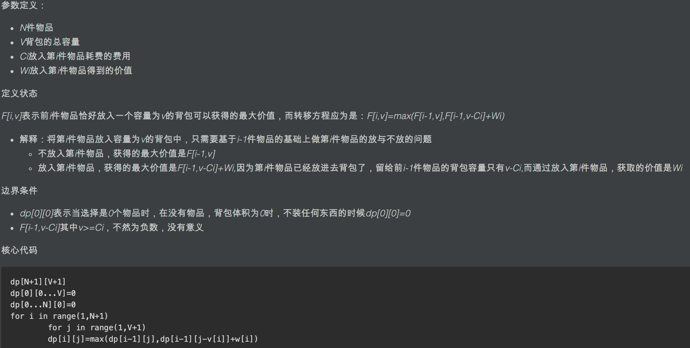

```java
class Solution {
        int[][] memo;
        int res = 0;
        public int findMaxForm(String[] strs, int m, int n) {
            memo = new int[strs.length][2];
            for(int i=0; i < strs.length; i++){
                convert(strs[i],i);
            }
            dfs(m,n,0,0);
            return res;
        }

        public void convert(String s,int idx){
            for(int i=0; i < s.length(); i++){
                char c = s.charAt(i);
                if(c == '0') {
                    memo[idx][0]++;
                } else if(c == '1'){
                    memo[idx][1]++;
                }
            }
        }

        public void dfs(int m, int n, int start, int len){
            if(m == 0 && n ==0){
                res = Math.max(res,len);
                return ;
            }

            for(int i=start; i < memo.length; i++){
                if(memo[i][0] <= m && memo[i][1] <= n){
                    dfs(m-memo[i][0],n-memo[i][1],i+1,len+1);
                }
            }

            res = Math.max(res,len);
        }
}
```

记忆化搜索+DFS ：TLE 22/69


### 背包问题



```java
class Solution {
    public int findMaxForm(String[] strs, int m, int n) {
        int[][] dp = new int[m+1][n+1];
        for(String str : strs){
            int[] cs = convert(str);
            for(int zeros=m; zeros>=cs[0]; zeros--){
                for(int ones=n; ones>=cs[1]; ones--){
                    dp[zeros][ones] = Math.max(1+dp[zeros-cs[0]][ones-cs[1]],dp[zeros][ones]);
                }
            }
        }
        return dp[m][n];
    }

    public int[] convert(String s){
        int[] cs = new int[2];
        for(int i=0; i < s.length(); i++){
            cs[s.charAt(i)-'0']++;
        }
        return cs;
    }
}
```

```
m=3,n=2
10，01，101，0

  0 1 2 
0 
1
2
3
```

TODO：二维背包比较难理解


```java
class Solution {
    public int findMaxForm(String[] strs, int m, int n) {
        int len = strs.length;
        int[][][] dp = new int[len+1][m+1][n+1];
        for(int k=1; k < len+1; k++){
            int[] cs = convert(strs[k-1]);
            for(int i=0; i < m+1; i++){
                for(int j=0; j < n+1; j++){
                    if(i >= cs[0] && j >= cs[1]){
                        dp[k][i][j] = Math.max(dp[k][i][j],dp[k-1][i-cs[0]][j-cs[1]]+1);
                    }
                    dp[k][i][j] = Math.max(dp[k][i][j],dp[k-1][i][j]);
                }
            }
        }
        return dp[len][m][n];
    }

    public int[] convert(String s){
        int[] cs = new int[2];
        for(int i=0; i < s.length(); i++){
            cs[s.charAt(i)-'0']++;
        }
        return cs;
    }
}
```

```
dp[k][i][j] 遍历第k个字符串时，拥有i个0，j个1，能够获取的最长字符串集合

dp[k][i][j] = Math.max(
	dp[k][i][j], //保证获取的是最大值
	dp[k-1][i][j]), //不选择k个字符串
	dp[k-1][i-count[zero]][j-count[one]]+1 //选择k个字符串，但是只有保证i>=count[zero]以及j>=count[one]时可更新
;
```


