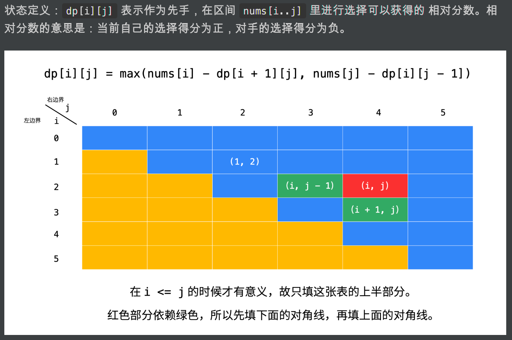

## DP

```java
class Solution {
    public boolean PredictTheWinner(int[] nums) {
        int len = nums.length;
        //定义：表示当前先手，能够领先的分数
        int[][] dp = new int[len][len];
        //1. 初始化数组
        for(int i=0; i < len ;i++){
            dp[i][i] = nums[i];
        }
        //2. 状态流转
        for(int i=len-2; i >= 0; i--){
            for(int j=i+1; j < len; j++){
                dp[i][j] = Math.max(nums[i]-dp[i+1][j],nums[j]-dp[i][j-1]);
            }
        }
        //3. [0,len]是否领先
        return dp[0][len-1] >= 0;
    }
}
```



① `dp[i][j]` 表示先手在当前位置获取的领先分数

② `dp[i][j] = max(nums[i]-dp[i+1][j],nums[j]-dp[i][j-1])`

这个定义比较绕，例如对a1，a2，... an集合，先手选择了a1，剩下的就是(a2，... an)集合，所以f（a1，a2，... an） =  a1-f（a2，... an）表示相当于（a2，... an）集合先手能够获取的领先分数之差

因为（a2，... an）集合一定是给对手，所以要尽可能让f（a2，... an）更小，并且a1-f（a2，... an）更大


```java
class Solution {
    int[][] dp = new int[21][21];
    public boolean PredictTheWinner(int[] nums) {
        dfs(nums,0,nums.length-1);
        return dp[0][nums.length-1]*2 >= sum(nums,0,nums.length-1);
    }

    public int dfs(int[] nums,int L, int R){
        if(dp[L][R] != 0){ //这个剪枝很重要
            return dp[L][R];
        }
        if(L == R){
            dp[L][R] = nums[L];
            return nums[L];
        }
        dp[L][R] = sum(nums,L,R) - Math.min(dfs(nums,L+1,R),dfs(nums,L,R-1));
        return dp[L][R];
    }

    public int sum(int[] nums, int L, int R){
        int sum = 0;
        for(int i=L; i <= R; i++){
            sum += nums[i];
        }
        return sum;
    }
}
```

1、记忆化搜索

2、`dp[i][j]`表示从i开始到j结束，先手能够获取的最优分数

3、`dp[i][j] = sum(i,j) - Math.min(dp[i+1][j],dp[i][j-1])` 下个选手能够获取的最小分数，就是当前选手获取的最大分数


