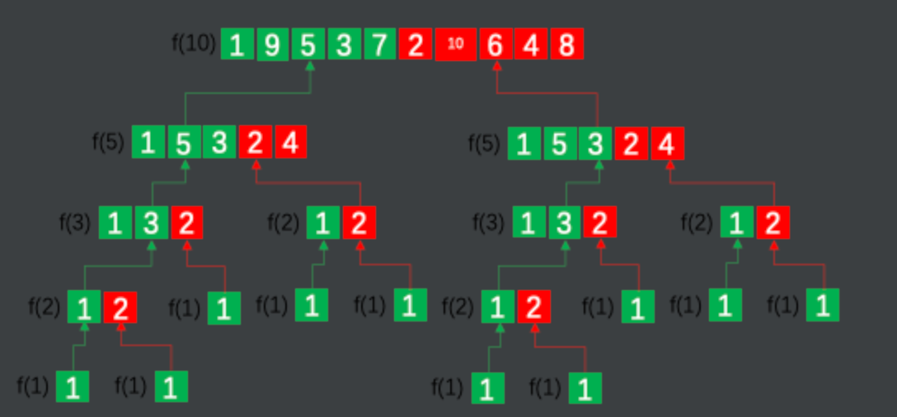

```java
class Solution {
        Map<Integer,int[]> memo = new HashMap<>();
        public int[] beautifulArray(int N) {
            return f(N);
        }

        public int[] f(int N){
            if(memo.containsKey(N)){
                return memo.get(N);
            }
            int[] ans = new int[N];
            if(N == 1){
                ans[0] = 1;
            } else {
                int t = 0;
                for(int x : f((N+1)/2)){ //奇数
                    ans[t++] = 2*x-1;
                }
                for(int x : f(N/2)){ //偶数
                    ans[t++] = 2*x;
                }
            }
            memo.put(N,ans);
            return ans;
        }
    }
//leetcode submit region end(Prohibit modification and deletion)
}
```

关于漂亮数组的定义：
对于所有的k，i < k < j，不存在`A[k] * 2 = A[i] + A[j] ` 


① `A[k] * 2 = A[i] + A[j] `  这个等式，左边肯定是偶数，要让右边如果一个是奇数，一个是偶数，相加肯定是偶数，肯定不相等

② 如果将N的所有奇数放到一起（left部分），所有偶数放到一起（right部分），对于1~N的整数，有(1+N)/2个奇数，N/2个偶数

③ 假设{X，Y，Z}是一个漂亮数组，那么{k\*X+b，k\*Y+b，k\*Z+b}也是一个漂亮数组

例如对于N=10，分治为f（5）个奇数和f（5）个偶数



对于N=1，[1]是漂亮数组（这是最底层的起因）

对于N=2，[1，2]是漂亮数组，

通过[1，2] * 2  - 1 = [1，3]，就是新的奇数数组，通过[1，2]*2 = [2，4]，就是新的偶数数组


Tips：如果下次再遇到相同的问题，会怎样去思考得到这个解题思路？

推理过程：

（1）例如对于10，把所有的奇数放到左边，所有的偶数放到右边，这样能保证整体上是个漂亮数组，但是左边奇数数组内部如何保证是漂亮数组？

（2）假设{X，Y，Z}是一个漂亮数组，那么{k\*X+b，k\*Y+b，k\*Z+b}也是一个漂亮数组，左边的奇数数组如果是由漂亮数组生成，那么肯定也是漂亮数组，右边同理，这就拆分为了子问题


